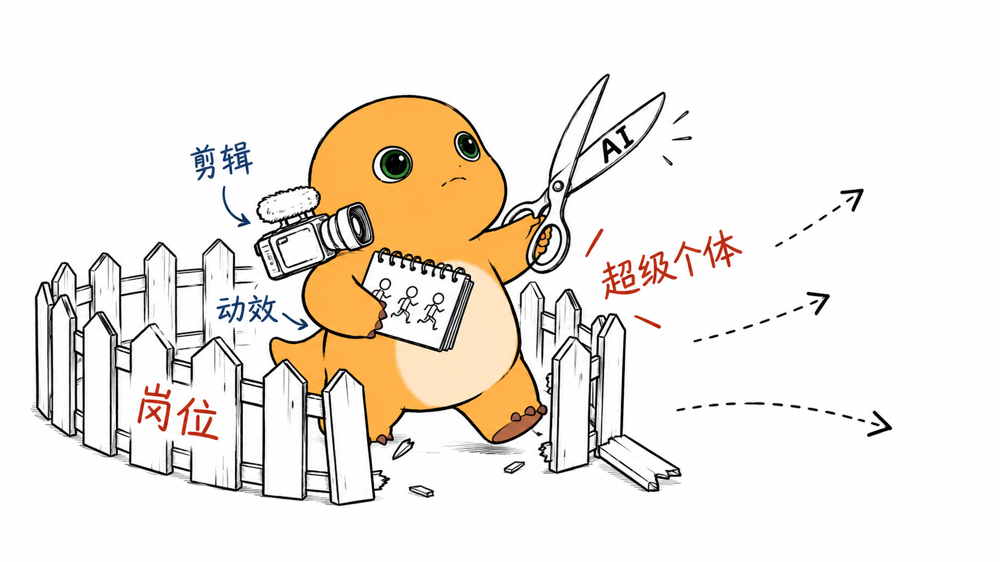
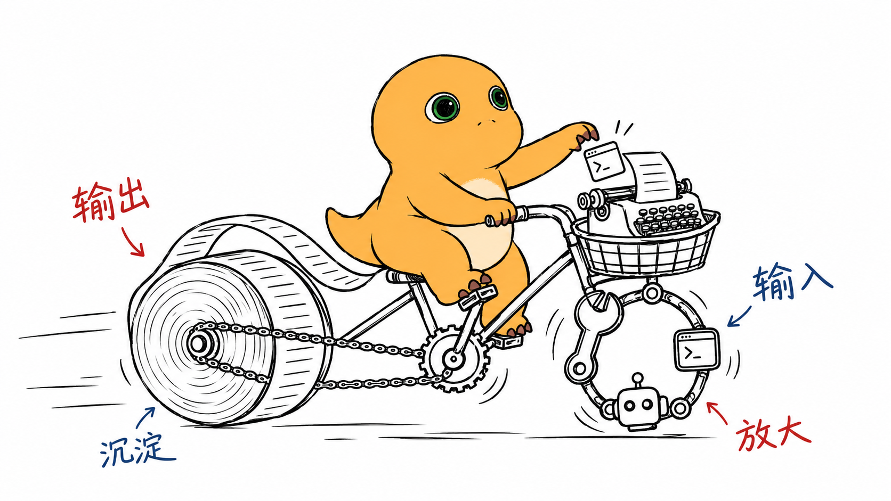

# Nailong-image · 用你喜欢的 IP 给文章画手绘配图

> An agent skill that turns a paragraph or a whole article into hand-drawn 16:9 illustrations starring any mascot IP you choose — 奶龙 (Nailong) is just the built-in sample.

把一段话或一整篇中文文章，变成**干净、有记忆点、一眼能看懂的手绘解释图**：先出配图策略（shot list），再逐张生成 16:9 横版配图——纯白背景、黑色手绘线稿、大量留白，**你的 IP 是画面里唯一的彩色主角**，亲自完成核心动作，再配几句红 / 蓝手写批注。

**主角可以换成任何你喜欢的 IP / 吉祥物。** 仓库自带的「奶龙」只是一个示例 IP，也是没选 IP 时的默认主角。

## 效果示例：奶龙 ×《AI 时代我最近想得最多的三个点》

原文：[article.md](examples/kin-three-points/article.md) ｜ 配图策略：[shotlist.md](examples/kin-three-points/shotlist.md) ｜ 提示词：[prompts/](examples/kin-three-points/prompts/) ｜ 奶龙档案：[ips/nailong.md](ips/nailong.md)

**01 不是冲刺，是马拉松** —— 奶龙拆掉起跑器挂上吊床，在 5 年 / 10 年 / 20 年的里程牌旁打盹：睡觉就是补给站。


**02 80% 的力气花在揣摩上** —— 奶龙举着放大镜研究悬在半空的「老板眉毛」，真正想做的画架被冷落在角落。


**03 剪开岗位的围栏** —— 奶龙用写着「AI」的大剪刀剪开「岗位」栅栏，抱着摄像机和翻页动画本迈出去。



**04 AI 是那根支点** —— 小小的奶龙压着「专长」砖块，借「AI」支点撬起比自己大十倍的气球。


**05 两个轮子一起转** —— 前轮是工具（输入），后轮是文章纸卷（输出），两个轮子一起转才能往前走。



**06 自己挖的护城河** —— 奶龙把一页页笔记铲进河道，分享出去的知识反而挖宽了「个人IP」的护城河。


> 📌 这 6 张成图里的奶龙形象稳定一致，**同时也是奶龙的补充角色参考图**，可以和 [`assets/character/nailong/`](assets/character/nailong/) 一起作为 `-i` 参考传入。

## 换成你自己的 IP

第一次使用时，skill 会自动引导你：

1. **看效果**：先给你看上面的奶龙案例，说明它能做什么。
2. **问你要不要换 IP**：不换就继续用奶龙。
3. **建立你的 IP**：
   - 上传一张你的 IP 图片，**或者**让它帮你生成一张定妆图（正面全身、纯白背景、无道具、无文字）；
   - 保存到 `assets/character/<ip-slug>/ref-front.png`；
   - 按 [`ips/_template.md`](ips/_template.md) 写一份角色档案 `ips/<ip-slug>.md`：名字、外形、**招牌色**（全图唯一的角色色彩）、性格、动作风格、禁忌；
   - 在 [`config/active-ip.md`](config/active-ip.md) 里把它设为当前 IP——从此它就是你这份 skill 的默认主角。
4. **开始配图**：把你的文字给它，先出 shot list，再逐张生成。

也可以手动完成上面第 3 步；随时说「换 IP」就能重新走一遍。奶龙档案 [`ips/nailong.md`](ips/nailong.md) 一直保留，可随时切回。

## 安装

本仓库本身就是一个 skill 目录（入口是 [SKILL.md](SKILL.md)）。建议 `git clone` 成可写目录，因为换 IP 时 skill 会往里写入你的参考图、档案和配置。

**Codex**

```bash
git clone https://github.com/KinGao294/Nailong-image.git ~/.codex/skills/nailong-image
```

**Claude Code**

```bash
# 全局（所有项目可用）
git clone https://github.com/KinGao294/Nailong-image.git ~/.claude/skills/nailong-image
# 或仅当前项目
git clone https://github.com/KinGao294/Nailong-image.git .claude/skills/nailong-image
```

**其他 Agent / Skills 插件**

把仓库 clone 到该工具的 skills 目录；如果工具不支持 skills，就把 `SKILL.md` 作为系统提示 / 规则文件加载，并保证它能读写本目录下的 `config/`、`ips/`、`assets/`。

## 用法

装好后直接对助手说「给这篇文章配图」「帮这段话画张图」「先出个 shot list」即可。

需要手动生图时，以 Codex CLI 为例——**一次调用只出一张图**，先附 IP 参考图，再从 stdin 传提示词（`-i` 可接多个文件，所以提示词用 `-` 读 stdin）：

```bash
codex exec --skip-git-repo-check -i assets/character/nailong/ref-front-clean.png - < prompt.txt
# 换成你的 IP：
codex exec --skip-git-repo-check -i assets/character/<ip-slug>/ref-front.png - < prompt.txt
```

提示词结构可参考 [`examples/kin-three-points/prompts/`](examples/kin-three-points/prompts/)，把奶龙描述换成你 IP 档案里的锁定句和招牌色。

## 风格规则速览

- **16:9 横版**，**纯白背景**，黑色手绘线稿，大量留白。
- **IP 的招牌色是全图唯一的角色色彩**，其他物件一律纯黑线稿、不填色。
- **IP 必须是核心动作主体**，不能只站在旁边当装饰。
- 只加**少量红 / 蓝中文手写批注**，宁少勿错。
- 禁止 PPT / 信息图感，禁止左上角类型标题、水印、签名。
- 每张图只讲一个核心结构；每篇文章重新发明隐喻，不复刻旧图。
- 参考图只锁定 IP 形象，不照抄场景和动作；同一篇文章 IP 前后一致。

完整工作流（shot list → 单张生成 → QA → 保存）见 [SKILL.md](SKILL.md)。

## 目录结构

```text
SKILL.md                         # Skill 本体（含首次使用引导）
config/active-ip.md              # 当前激活的 IP（默认 nailong）
ips/_template.md                 # IP 档案模板
ips/nailong.md                   # 示例 IP：奶龙
assets/character/nailong/        # 奶龙参考图（默认 ref-front-clean.png）
assets/character/<ip-slug>/      # 你自己的 IP 参考图（引导时创建）
examples/kin-three-points/       # 奶龙完整案例：原文 + shot list + 成图 + 提示词
LICENSE                          # MIT
```

## License

[MIT](LICENSE) © Kin
