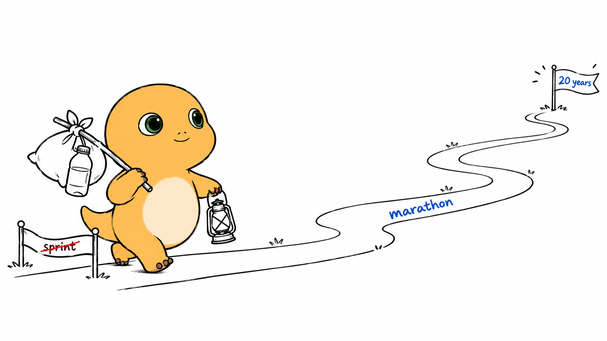
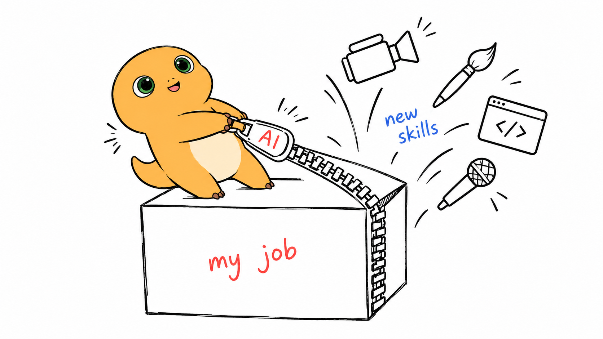
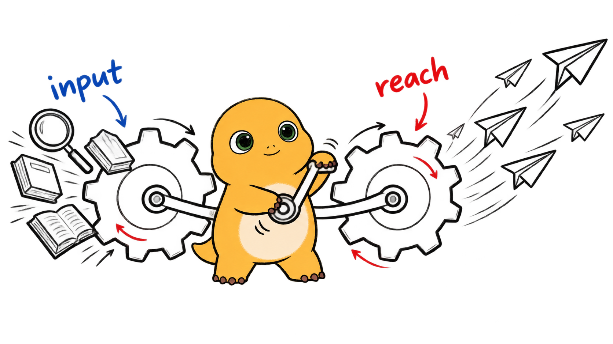

# 输入一整篇文章，AI 自动识别高光片段，生成生动形象的 IP 手绘配图

**IP 手绘**（ip-handdrawn）: Drop in an article in Chinese or English. AI picks the highlights and turns them into vivid hand-drawn scenes starring your mascot.

输入一整篇文章、一段话、一句话都行，中文英文都可以。尤其适合长文章：AI 会读完全文，挑出最值得画的几段，你不用逐段想配图。

## 你能得到什么

- 少花时间挑段落、想画面。AI 会读完全文，找出适合配图的位置。
- 抽象观点会变成具体场景，读者扫一眼就能明白。
- 每张图都由你的 IP 主演，文章更容易被认出、被记住。

成图会保持统一：白底、黑色手绘线条，只有 IP 带角色色彩，再配少量红 / 蓝手写字。

推荐在 **[Codex](#codex)**、**[Cursor](#cursor)**、**[Grok Bot](#grok-bot)** 里用。

## 三步用起来

1. 按下面的[安装](#安装)说明，把这个仓库装进你的 AI 助手。
2. 发出文章，再说一句「给这篇文章配图」。整篇文章效果最好，一段话或一句话也能画，中英文都可以。
3. AI 会先列出配图位置和画面内容，再逐张生成。哪张不合适，直接让它重画。

默认主角是「奶龙」。想换成你自己的 IP，[看这里](#换成你自己的-ip)。

## 看看效果：整篇文章配图 · 奶龙 ×《AI时代最重要的三点思考》

下面 6 张图，都由 AI 从[《AI时代最重要的三点思考》原文](examples/kin-three-points/article.md)中选段并配图。每张图上方是原文，下方是画面说明。

### 01 AI 不是百米冲刺、而是马拉松

> 所以我希望在接下来的人生里，真的能做到少熬夜、多运动，养成良好的作息习惯，然后和 AI 打一场持久战。 因为它确实不是一场百米冲刺，而是未来 5 年、10 年、20 年的一场马拉松。

🎨 奶龙拆掉起跑器，挂起吊床，穿着跑鞋在 5 年、10 年、20 年的路牌旁打盹。睡好觉，才跑得久。


### 02 工作里 80% 的力气，都花在揣摩心思上

> 为什么要做这个决定？因为我后来发现，在一份工作里，100% 的时间里可能只有 20% 是真正想做的那件事，剩下 80% 都是非常琐碎、又很费力的工作。举两个例子：准备 ppt 汇报时，一个措辞你需要反复揣摩几十轮；开会时老板一个眼神停顿两秒，你就要当面揣摩他是认可还是不满——这种揣摩心思的工作，是真正消耗心力的。

🎨 奶龙举着大放大镜，研究半空中的「老板眉毛」。身后摆着第 37 版 PPT，真正想做的画架却落在角落。


### 03 AI 剪开了岗位的围栏、让每个人都能跨界

> 但这几年，AI 来啦，我认为 AI 时代，我们的职业选择是比以往更宽的。 以前你做这个岗位，就只能做这个岗位；现在不是了。比如我以前完全不会做视频，AI 来了之后我开始会做视频剪辑甚至动效设计了。职业的边界被 AI 打开了，也更适合超级个体去闯。

🎨 奶龙用写着「AI」的大剪刀剪开「岗位」栅栏，抱着摄像机走向新领域。


### 04 AI 是支点、把你的专长放大

> AI 把杠杆放下了，每个人都有机会把自己的专长放大。这是一个更适合超级个体的时代，我们值得认真地试一试。

🎨 小小的奶龙压住「专长」砖块，借「AI」这个支点，撬起比自己大十倍的气球。


### 05 研究 AI 是输入、做内容是输出，两个轮子一起转

> 一年下来我发现，研究 AI 工具和做自媒体内容 IP，是一件非常互补的事。 研究给我输入，输出给我放大——输入没有输出，沉淀不下来；输出没有输入，很快就会枯竭。 两个轮子一起转，飞轮才转得起来。

🎨 前轮是 AI 工具（输入），后轮是文章纸卷（输出）。奶龙同时蹬动两个轮子，车才向前走。


### 06 把知识分享出去、挖成自己的护城河

> 当然，我们 SpacexAI 社区目前有 30 多个中文微信社群，如果你有一些好的想法，不只是想在线下和自己渠道分享，也想通过直播、文章或视频的方式做线上分享，也欢迎来找我聊。 这方面我非常开放——AI 时代需要有更多人把自己脑子里的专业知识拿出来分享，既能帮到别人，也能一点点把"个人影响力"^_^护城河建起来。

🎨 奶龙把一页页笔记铲进河道。分享越多，「个人IP」沙堡外的护城河越宽。


> 📌 这 6 张图里的奶龙形象前后一致，也可以当作奶龙的补充参考图使用。

## English 示例：一句话也能配图

不一定非要输入整篇文章。下面每张图只用了一句英文（转述自同一篇文章的关键句），图中的手写字也会跟着变成英文。来源见 [source.md](examples/one-sentence-en/source.md)，提示词见 [prompts/](examples/one-sentence-en/prompts/)。

### 01 AI is not a 100-meter sprint; it's a 20-year marathon.

> AI is not a 100-meter sprint; it's a 20-year marathon.

🎨 奶龙背着枕头和水壶、提着灯笼，跨过「sprint」终点线，走上通往「20 years」小旗的长路。



### 02 AI has opened up the boundaries of every job.

> AI has opened up the boundaries of every job.

🎨 奶龙站在「my job」箱子上，拉开写着「AI」的大拉链，摄像机、画笔、代码窗口和话筒一起飞出来。



### 03 Research gives me input, content gives me reach — two wheels turning together.

> Research gives me input, content gives me reach — two wheels turning together.

🎨 奶龙摇动曲柄，带动两只齿轮。左边吞进放大镜和书（input），右边放飞一串纸飞机（reach）。



## 换成你自己的 IP

奶龙只是示例。吉祥物、宠物或你画的小人，都能换成主角。以后配图不用反复描述角色，也更容易保持形象一致。

第一次使用时，AI 会问你要不要换 IP。想换的话，跟着做三步：

1. 给它一张你的 IP 图片。没有现成图片，就描述一下，让 AI 画一张正面、全身、白底、不带道具和文字的参考图。
2. 说清楚 IP 的名字、外形、主色、性格和常用动作。AI 会整理成角色档案。
3. 把它设为默认主角。此后每次配图都会用这个 IP；想切回奶龙，说一声就行。

随时说「换 IP」，可以重新来一遍。

## 安装

建议用 `git clone` 安装，不要只下载 SKILL.md。换 IP 后，参考图和角色档案都要存在这个目录里，之后才能直接复用。

### Codex

```bash
git clone https://github.com/KinGao294/ip-handdrawn.git ~/.codex/skills/ip-handdrawn
```

装好后，在 Codex 里说「给这篇文章配图」。Codex 自带画图能力，不需要另外配置生图工具。

### Cursor

```bash
# 所有项目都能用
git clone https://github.com/KinGao294/ip-handdrawn.git ~/.cursor/skills/ip-handdrawn
# 或者只给当前项目用
git clone https://github.com/KinGao294/ip-handdrawn.git .cursor/skills/ip-handdrawn
```

装好后，在 Cursor 的 Agent 里说「给这篇文章配图」，或输入 `/ip-handdrawn`。

### Grok Bot

把下面这句话发给 Grok Bot：

> 把 https://github.com/KinGao294/ip-handdrawn clone 到你的电脑里，把 SKILL.md 保存成我的私有 skill，参考图和案例都用这个目录里的。

保存后，在输入框输入 `/`，选中它就能用。如果没有看到，去 Settings → Plugins → Yours，为当前 Bot 打开它。

### 其他工具

Claude Code 也能用：`git clone https://github.com/KinGao294/ip-handdrawn.git ~/.claude/skills/ip-handdrawn`。其他支持 Agent Skills 的工具，clone 到对应的 skills 目录即可。

---

## 给想深究的人

### 它具体怎么工作

1. AI 先读全文，判断文章语言（中文 / 英文），再找适合用画面表达的段落，如核心观点、转折、前后对比、循环和常见误区。
2. 接着列配图计划（shot list），写清每张图放在哪里、讲什么、IP 做什么、图里写哪些字。整篇文章默认 4–8 张，短文或一段话 1–3 张，一句话 1 张。
3. 然后逐张画。每张只讲一件事，并根据文章重想比喻，不重复套用旧图。
4. 出图后检查 IP 是否走样、有没有参与核心动作、画面是否太满、文字是否有误，有问题就重画。
5. 最后存到 `assets/<文章名>-illustrations/01-xxx.png`，按顺序编号，不覆盖已有文件。

完整规则见 [SKILL.md](SKILL.md)。

### 画风规则

- 16:9 横版，纯白背景，黑色手绘线稿，大量留白。
- 只有 IP 保留角色色彩；其他元素都用黑色线条，不上色。
- IP 必须在做画面的核心动作，不能只当装饰。
- 只写少量红 / 蓝手写字，并跟随文章语言（中文文章写中文，英文文章写英文）。字可以少，不能写错。
- 避免画成 PPT / 信息图，也不加左上角标题、水印或签名。
- 参考图只用来锁定 IP 长相，不照抄它的姿势和场景。

### 用 Codex 命令行手动出图

一次只生成一张。先附上 IP 参考图，再从 stdin 传入提示词（`-i` 可以接多个文件，所以提示词用 `-` 读取 stdin）：

```bash
codex exec --skip-git-repo-check -i assets/character/nailong/ref-front-clean.png - < prompt.txt
# 换成你的 IP：
codex exec --skip-git-repo-check -i assets/character/<ip-slug>/ref-front.png - < prompt.txt
```

提示词写法可参考 [`examples/kin-three-points/prompts/`](examples/kin-three-points/prompts/)，把奶龙的描述替换成你的 IP 档案内容。案例的配图计划见 [shotlist.md](examples/kin-three-points/shotlist.md)。

### 换 IP 的文件在哪

- [`config/active-ip.md`](config/active-ip.md)：当前用哪个 IP（默认 `nailong`）。
- [`ips/_template.md`](ips/_template.md)：角色档案模板；你的档案存为 `ips/<ip-slug>.md`。
- [`ips/nailong.md`](ips/nailong.md)：示例 IP 奶龙的档案。
- `assets/character/<ip-slug>/ref-front.png`：你的 IP 参考图；奶龙的在 [`assets/character/nailong/`](assets/character/nailong/)。

### 目录结构

```text
SKILL.md                         # Skill 本体（含首次使用引导）
config/active-ip.md              # 当前激活的 IP（默认 nailong）
ips/_template.md                 # IP 档案模板
ips/nailong.md                   # 示例 IP：奶龙
assets/character/nailong/        # 奶龙参考图（默认 ref-front-clean.png）
assets/character/<ip-slug>/      # 你自己的 IP 参考图（引导时创建）
examples/kin-three-points/       # 奶龙完整案例：整篇文章 + 配图计划 + 成图 + 提示词
examples/one-sentence-en/        # 英文一句话示例：3 句英文 + 成图 + 提示词
LICENSE                          # MIT
```

## License

[MIT](LICENSE) © Kin
